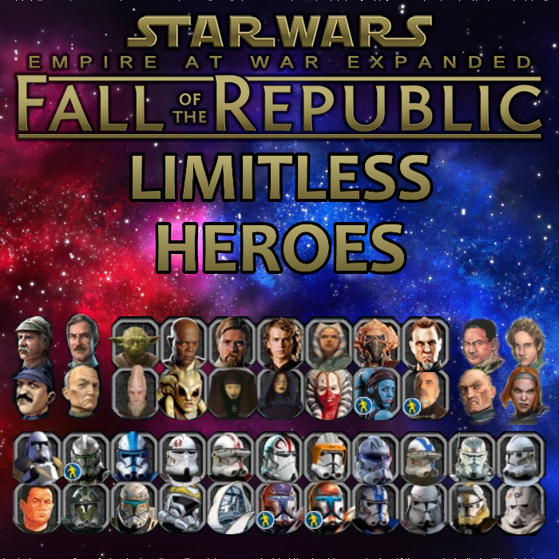

**Disclaimer**: This project is not affiliated with the EaWX team.

# FotR Limitless Heroes

Do you want more republic hero slots? Do you want complete control of your hero roster?
This submod removes restrictions on the amount of heroes allowed for the player.
Don't worry. The AI will not recruit any extra heroes by itself!
Rather, the AI only gains another hero if they take a planet from the player.

### Republic

As the republic player, you may assign as many or as few heroes as you deem necessary.
Note that just because you can recruit every hero doesn't mean you have to.
Some hero options are still locked by prerequisites or for story purposes.

- The Senate: A new category has been added for access to senators.
- Story Option: Supporting the Sector Governance Decree will reward you with a few random special units at random planets.
- For Mandalore: You may support both of the Mandalorian clans if the republic gets there first, but the republic AI won't do this.
- The Advanced Options tab has a button to instantly set the senate approval rating to 100%, which will unlock the story options early.

### CIS

- Three new hero categories have been added: Space Leaders, Ground Leaders, and Sith.
  These work the same as the Republic hero system, and can be used to assign and retire heroes.
- Unite Mandalore: You may support both of the Mandalorian clans.
- Bounty Hunters: You may hire all five mercenary heroes instead of only one.
- The Advanced Options tab has buttons that will instantly integrate the subfaction chosen, giving you their heroes and planets.
  There are also some unique ships that can be built.

### One Planet Start

- Heroes spawn at the beginning of FTGU single planet start games, matching the era selected.
- Enabled Republic command staff. Clones are disabled in era 1.

### Skirmish

All space heroes are now available in skirmish space.

# License

All **original code** authored in this project is available under the [MIT License](LICENSE).

This repository depends on files derived from **EaWX mods**.
See [ASSETS.md](ASSETS.md) for details on third-party content and asset usage.

### Workshop Content

The `mod/` directory contains the files uploaded to the Steam Workshop.

# Credits

Thanks to the EaWX team for creating and maintaining the EaWX mods.
